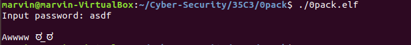
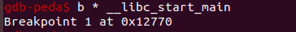
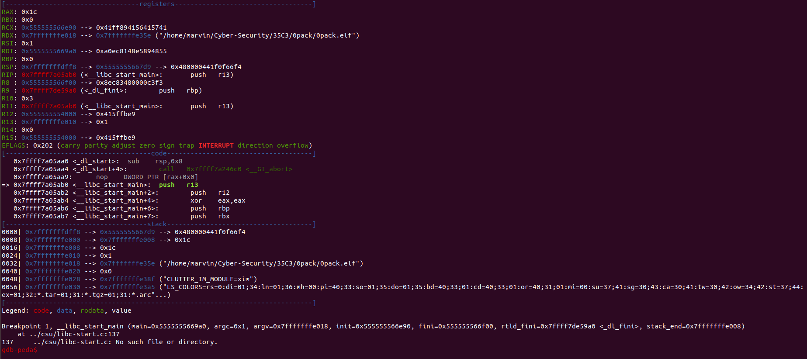
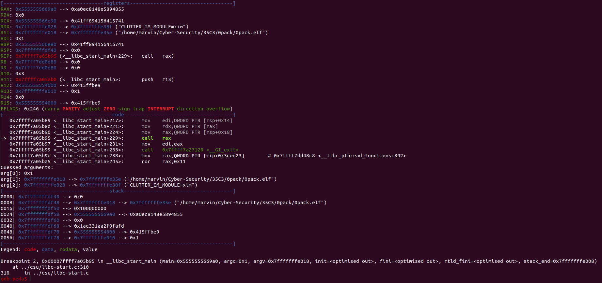
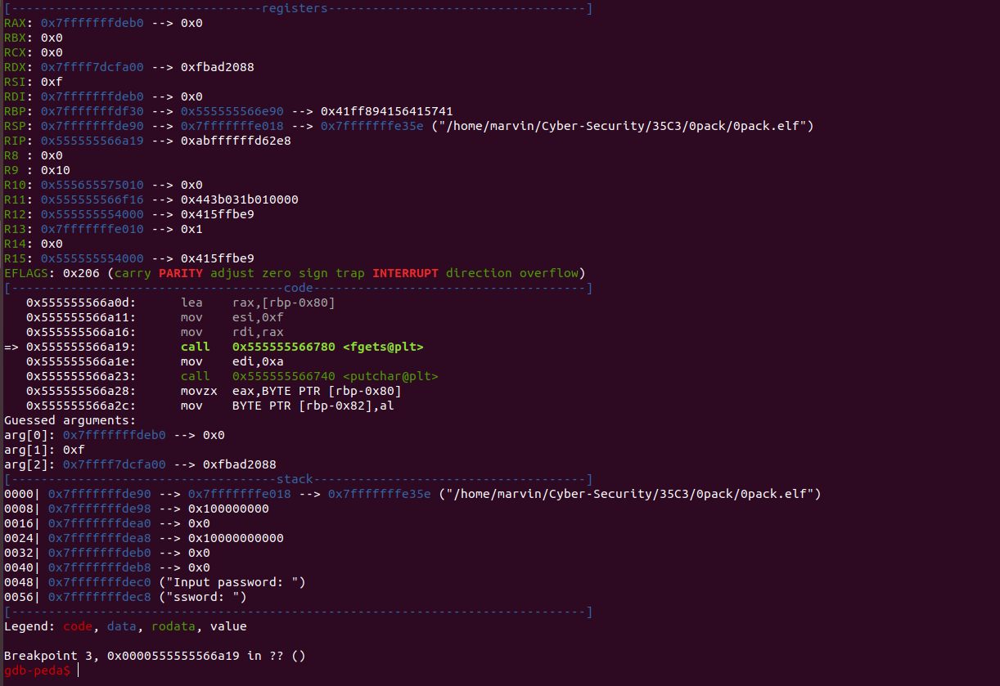
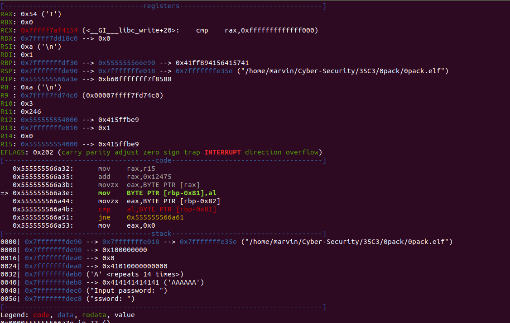
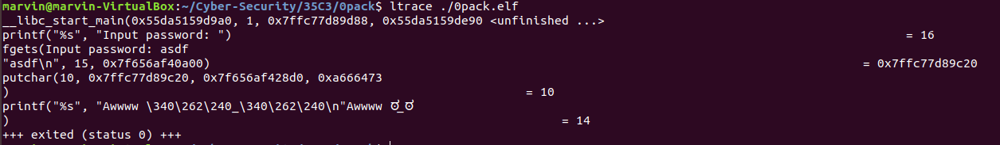

This challenge was part of 35C3 and I had a lot of fun solving it. I learned more about the elf library and kind of solved it in two
really stupid ways, so let us begin.

To start off, we were given an elf library file. I'll skip the file command part, but basically an elf file is like an executable 
file but with the libraries included. When we run 0pack.elf, we get this.

Seems like we will have to enter a password. This is where I brought up GDB and decided to run it but found that while it runs, I 
can't seem to break anywhere. I tried breaking at main, at the entry point and some other places I knew, however nothing would stop
the execution. Confused I threw the binary into hopper and found some pieces of code but I couldn't find anything useful. I decided
to break at __libc_start_main and eventually that worked. 

An interesting note, when I was following through the disassembly, I found that the address for the c file was different. These 
addresses started with 0x7F while the c file started with 0x55, so when I tried to run again in GDB it couldn't place the second
break point and it would crash. 

Here is the disassembly before it enters the main C code. 

And here is the disassembly before we are asked for our input

Lastly here is a comparison, this is where I found the flag the first time (the EAX register) 

Here I had pretty much already found the flag, however I was really dumb and couldn't submit it correctly. The flag btw is 
ThisIsATriumph. I couldn't verify this was the correct flag as when I entered it into the program, the same output appeared. 
I was convinced that this meant I was missing something and went back to the drawing board. 

I started off with ltrace

I found that when I entered in certain input, a bunch of sleeps would appear. 

I later realized this correlated to the A in the password I had just found and when I entered in the password a bunch of sleeps
appeared. I decided to script out the solution and brute force the password by going through the letter/symbol combinations that
made more and more sleeps appear. Surprise surprise I got the same answer... this is where I finally submitted the flag correctly.

Yes I am stupid, apologies. 

