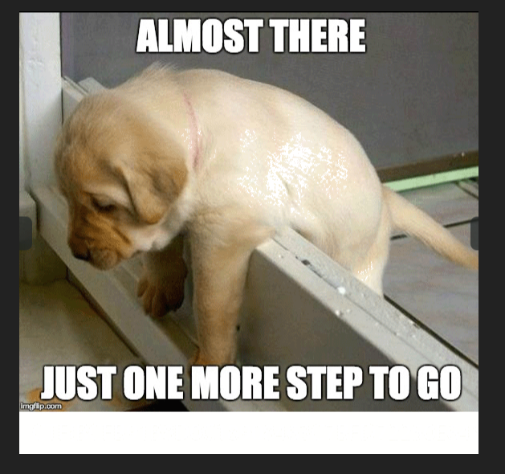

This challenge was part of a Deloitte University Challenge. It was a relatively simple steganography challenge that you could 
solve by running command line tools, however I learned a lot on the way. 

To start with, you were given a JPG file.

Now normally there are only a few techniques CTF's use for steganography. I knew from prior knowledge that hiding files inside
other files was very easy to detect with binwalk and decided to check first before I tried anything more complicated. 

Seeing that there was a PNG file in there I tried to extract it but was unsuccessful. I kept getting this random data that 
didn't make sense. 

So I tried to be more specific by limiting the extraction to just the PNG file and got it. 

Here is the image

With this other image I tried running binwalk but was not successful. Therefore I tried running another tool called zsteg. Again,
with these types of challenges often times they hide images by spreading them out across the RGB and alpha channels. Zsteg allows
you to filter through these channels and detects if there are any files in them by using magic bytes (the bytes at the beginning
of a file which tell you what type of file it is).

Running zsteg gave me this. 

As you can see, there are a lot of files generated but I thought that the gif was interesting so I decided to extract that first.

And it gave me this

Looking closer I saw that the white space underneath was oddly blank so simply putting it into paint and painting some area's
revealed the flag.

Thanks for reading!

