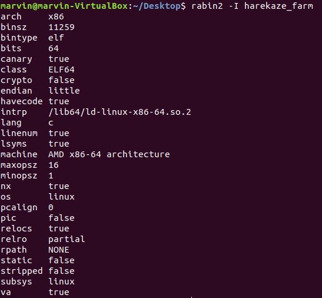

This challenge was part of the HareKaze 2018 CTF. It is a little tricky and I didn't manage to solve it during the CTF
but I figured it out afterwards. If you want to follow along, the binary is in the current repository.

To start with we are given a binary file, so let us run the basic commands on it. 

Here is the output of file


and the output of rabin2



Hmm nothing looks strange so far. Lets run the binary and see if we can get more information. 


As you can see, entering random words doesn't do anything and it doesn't seem to react to a buffer overflow. At this point
I realize that the binary will give me more information but before we start debugging let's try and run strings to see if
that will provide some answers. 


Hmm, looks like some animals are listed and their associated sounds are produced. Isoroku looks interesting as its sound hints to
the flag. Let's try some of these strings. 


Damn, I was hoping it would be this easy. Ah well, looks like we have to dive into the binary to get more information. 
Loading the binary up in Radare2 and using the command 'VV' to enter visualization mode, we can start to understand the program.

Here I have shown the start of the main program. 


Well it looks like three animals have to be added before we can go to the parade part where the animal noises are printed as 
shown with the jump less than or equal to and the comparison to 2.  

Here is the animal noises being printed. As you can see, entering isoroku will output the flag. 


Now we gotta figure out why it isn't printing the flag. Let's see what happens when we are inputting the animals.


Hmm this answer's some of our questions. First of all, the read_chk is a secure read that protects against buffer overflows 
which explains why our buffer overflow didn't do anything to our program. Furthermore we see that it is using string compare
(strcmp) to compare our strings against strings with animals values such as "cow". 


Scrolling down further into the program, we see that there is no comparison for "isoroku" and if the string we entered doesn't match one of the values then the program will ignore it. Seems like in order to solve this issue we need to take advantage 
of a strcmp quality, mainly that the comparision will stop reading after it encounters a null byte. We might be able to 
append isoroku onto a legit value and the program will add it to stack and then when the parade begins, the flag will be read.

Right so here is our payload idea so far:

payload = "hen" + "\x00" + "isoroku"

Trying this out, we run into an error. 


Looking at it in GDB we can see that hen was added fine to the stack but isor was left
off and only oku was added. You can see that in fact isor was added but on to the end of hen if you convert the hex to ascii.

726f7369006e6568 = rosi(\x00)neh in little endian format

Looks like we need some sort of padding, it shouldn't matter what though as the strcmp stops reading
after the null byte. Let us add some A's in. Here is the payload now:

payload = "hen" + "\x00" + ("A" * 4) + "isoroku"

Now let's try running it.


Hmm that is weird. Our value of isoroku is going in the stack correctly but we are getting these weird values after it. Also
our program seems to be hanging.... ahhh I forgot to end the strcmp. I need to add a null byte onto the end. This should do it:

payload = "hen" + "\x00" + ("A" * 4) + "isoroku" + "\x00"

And???


Success! Well kind of, the flag is actually on their server but if you look at the binary it shows that if we were running it
on their server we would get the flag :P


Hope you enjoyed the writeup!

Here is my script

```python
#harekaze_farm

from pwn import *

e = ELF("./harekaze_farm")

p = process("./harekaze_farm")


# print(p.recv())

# p.sendline("cow")
# print(p.recv())

# p.sendline("sheep")
# print(p.recv())

# p.sendline("hen\x00\x00\x00\x00isoroku")
print(p.recv())

p.sendline("cow")
print(p.recv())

payload="hen"+"\x00" + ("A"*4) +"isoroku"+"\x00"

#     --- Stack ---
# 0x41414141006e6568 ('hen')
# 0x756b6f726f7369 ('isoroku')

# The A's fill in the rest of the address,

p.sendline(payload)

print p.recvall()

```


