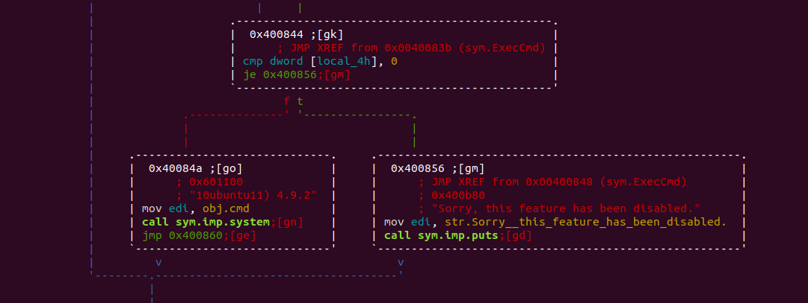

LSE Challenge Link: https://ctf.lse.epita.fr/ex/55/

This challenge was relatively easy to complete but provided a good review of the fundamentals. 

To start off we check the file headers on the binary,

We can see that the file isn't stripped which makes this challenge less cumbersome. 
Next we check the properties of the binary. 

Hmm, no ALSR but can't really tell much from here. Let's run the binary to see what this challenge is about.

Ah we need a username, well before we dive into the assembly, lets see if we can get the username and password
an easier way. By running strings. 

Huh, admin and T6OBSh2i look interesting. Let's try those.

Great we are in. Lets see what this binary can do.

Hmmmm, seems like we can't execute commands. Time to dive into the binary. 
Running radare2 on the binary we can see some interesting functions

Lets check out the execcmd function.

Huh, interesting. There doesn't seem to be a way of running systems. The strchr is looking for the newline character
which sinces we are using fgets will always be appended. Seems like we need to find another way in. Since this challenge
is only 50 points, let's try some common vunerablities. Let's enter a lot of characters into the read function. 

This looks promising. Seems like it is a buffer overflow, let's see what's happening behind the scenes. 

