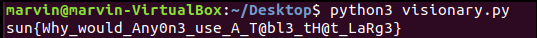

This challenge was part of Sunshine CTF 2018 and I learned more about cryptography in this one. I had never done this type of 
crypto before which made it refreshing from the usual Caesar Cipher or public key exchange. 

To start off with you were given 2 files, a visionary zip file and a file called table.tsv. 

Looking up what tsv stood for I found out it means tab seperated values and opening the file it look like it.

I could see some sort of pattern and decided to open up sublime to try and make sense of the mess. Opening it in sublime made
it extremely clear it was some sort of look up table. 

Simply googling table cipher brought me to the Vigenère cipher but I wanted to look more into the other folders before I
continued. Unzipping visionary we got three files,

A message:

The message deciphered:

And the flag:

You can read up on the Vigenère cipher but it is pretty intuitive. You take a message you want to encrypt and a key that repeats,
then simply using the table as a look up you use the two values(x,y) on a 1 to 1 relationship and you get a new letter. For example
if your message (x) was A and the key (y) was # you would be the value C. Knowing this I figured we would have to find out the key
from cipher1 and decipher1 and then use it on the cipherflag. 

To do this I created a script. 

'''
    alphabet = "!\"#$%&'()*+,-./0123456789:;<=>?@ABCDEFGHIJKLMNOPQRSTUVWXYZ[\]^_`abcdefghijklmnopqrstuvwxyz{|}~"

    axis_value =  "\"So,_did_you_hold_back_during_thattest?\"\"Maybe_a_little,\"_Sophronia_admitted._Soapgrinned.\"That's_my_girl.\"_Sophronia_glared_at_him._He_was_gettingfamiliar.\"You_are,_miss.\"_He_continued_togrin.\"I'm_my_own_girl,_thank_you_verymuch.\"―Gail_Carriger"

    table_value = "6(#KM5_3KYG^~]O\"9q#O4KLsbE{_yri|6(5SDjll`%J:WEs6q-WETYtwSqD#%](D\"*O0W3YIL]&Yls(#\"^8RV}[8v}4g]uI94M>o.SIJUMu?gD$)`@NVpL:~R&xYs6(~V:c[K(=H8VSs<w5b:NTuN@{{]{tgBUk0c0WAQj7V*hSBUqgS0C\}}a<\"fwwT*Dy3W?$O5eEH.n?%L\"~U:RY;LGzR\"~T/D)~d6hHYU;QMu ??Y\"W=?0p_E{Xw'"

    flag = ""

    bit = 0

    for d in table_value:

      pos_table = alphabet.find(d)
      pos_axis = alphabet.find(axis_value[bit:bit+1])

      bit += 1
      bit = bit % len(axis_value)

      y = (pos_table - pos_axis) % 94

      flag += alphabet[y:y+1]

    print(flag)

'''

Essentially, as we only got the x value of the table (from the cipher text) and the value (from the decipher) we needed to find
the value of y. To do this I created a string called alphabet and using a little math found that you essentially subtracting the
position of the table value from the position of x we get the new value. The mod 94 is to make sure if the value went over the 
length of the alphabet string, it went back to the beginning.

Doing this we got a key of: 

  5T3@mPuNk_Wh@t_5T3@mP_l0lR3p34t5T3@mPuNk_Wh@t_5T3@mP_l0lR3p34t5T3@mPuNk_Wh@t_5T3@mP_l0lR3p34t5T3@mPuNk_Wh@t_5T3@mP_l0lR3p34t5T3@mPuNk_Wh@t_5T3@mP_l0lR30s;#ZA{{:%Nd[F,Il6tFAuJ#sLSm*5rF<#9$dBQ1DJ>ZIG'WNN~G6l:6bMGyFce-fB&d9d2:q<zRul.PNO>URy^uJLF*yR

To be honest, I don't know what happens at the end but at least at the beginning we see a repetition of the key which is:
  
  5T3@mPuNk_Wh@t_5T3@mP_l0lR3p34t
  (steampunk_what_steamp_??no clue??)
  
Now using the key we can calculate the value of the flag. We have our x value again and our result but not the y value. Look's 
like we have to run the script again but we need to change the variables a bit. 

'''
    alphabet = "!\"#$%&'()*+,-./0123456789:;<=>?@ABCDEFGHIJKLMNOPQRSTUVWXYZ[\]^_`abcdefghijklmnopqrstuvwxyz{|}~"

    flag = ""

    table_value = ")J\"<E9o.cOMU%T!$NB/!0U`tLrqERuaG4(g.EUyM2?z>"

    axis_value = "5T3@mPuNk_Wh@t_5T3@mP_l0lR3p34t"
    
    bit = 0

    for d in table_value:

      pos_table = alphabet.find(d)
      pos_axis = alphabet.find(axis_value[bit:bit+1])

      bit += 1
      bit = bit % len(axis_value)

      y = (pos_table - pos_axis) % 94

      flag += alphabet[y:y+1]

    print(flag)
'''

We get the flag!

 
  

